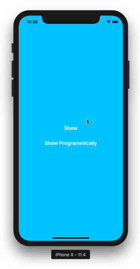

# Custom Segue Demo

This is the sample project that goes along with the [Elegant Custom UIViewController Transitioning](http://www.swiftkickmobile.com/elegant-custom-uiviewcontroller-transitioning-uiviewcontrollertransitioningdelegate-uiviewcontrolleranimatedtransitioning/) tutorial. Take a look and learn how to create elegant custom view controller transitions by encapsulating them in `UIStoryboardSegue` subclasses that work with Interface Builder's drag-and-drop interface.

  

